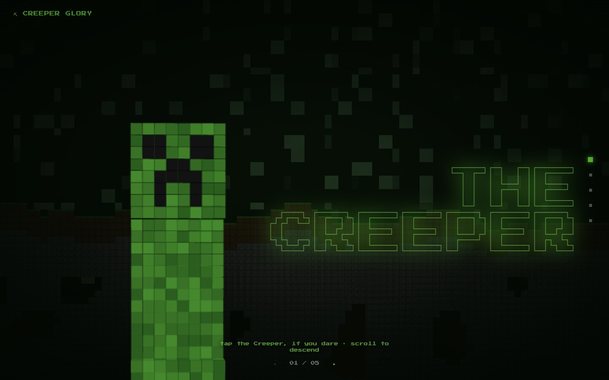

# Creeper Glory

> A cinematic, maximalist Minecraft showcase — production-grade motion design. React + Vite + Framer Motion.

**[Live demo](https://creeper.ayoubalkak.com)** · part of [my portfolio](https://ayoubalkak.com)



## What it is

A love letter to the Creeper, staged like a film title sequence: five cinematic panels (title, legend, powers, glory, finale) that build to an interactive detonation. The differentiator is the motion design — every entrance, stagger, and easing curve is deliberately orchestrated, not a scroll-library preset.

## How it works

- A slide-deck engine (`SlideDeck.jsx`) sequences five full-screen panels with Framer Motion — directional enters per panel side, custom cubic-bezier easing (`[0.16, 1, 0.3, 1]`), and an armed "detonate" finale.
- The Creeper itself is built in code: a voxel model (`CreeperModel`) and pixel-grid face (`CreeperFace`), matching the game's art direction without image assets.
- Maximalist on purpose — dense type, oversized panels, and a stat bar that scales in `whileInView` — while staying 60fps because everything animates on transform/opacity.
- A custom `useReducedMotion` hook threads through every animated component: with reduced motion on, transitions drop to opacity-only with zero duration and the blast sequence is skipped, not just slowed.

## Stack

`React` · `Vite` · `Tailwind` · `Framer Motion`

## Run locally

```bash
npm install
npm run dev
```

No environment variables needed.
